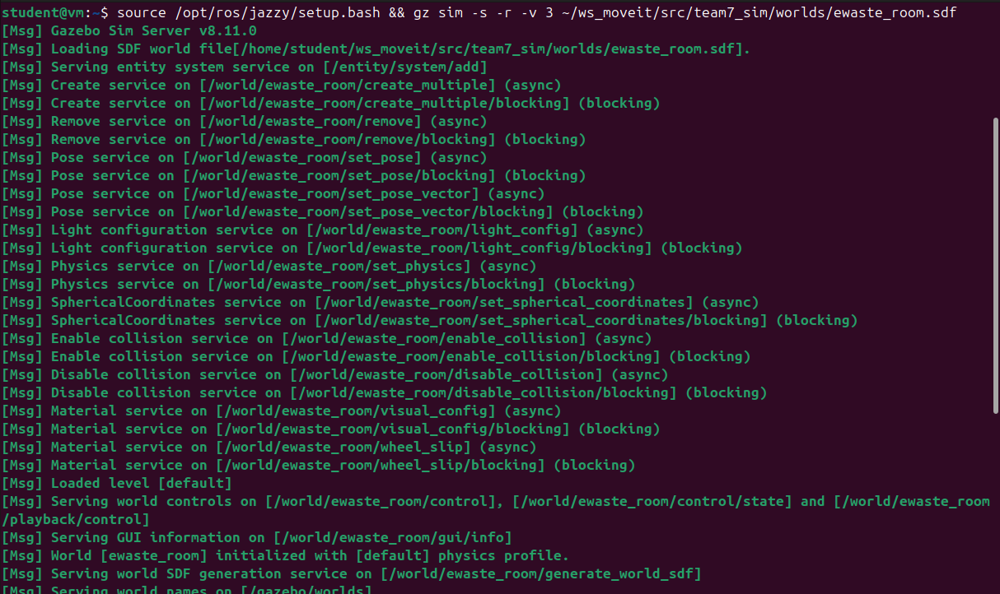
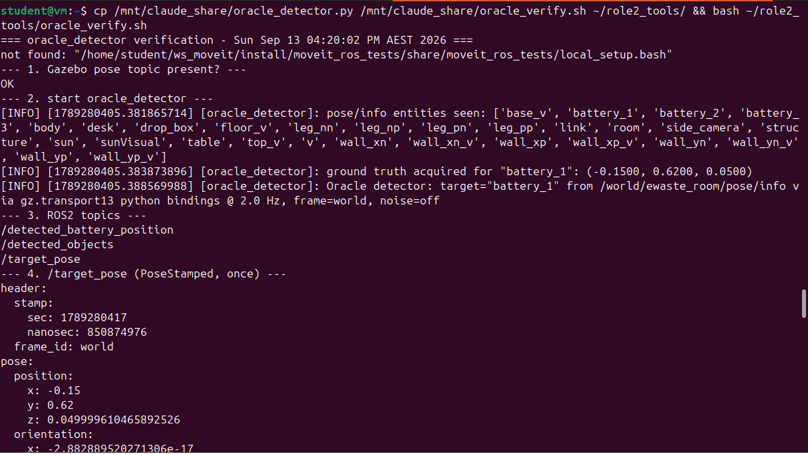
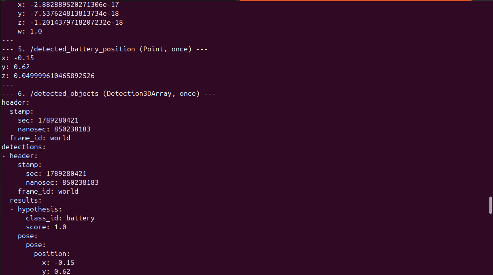
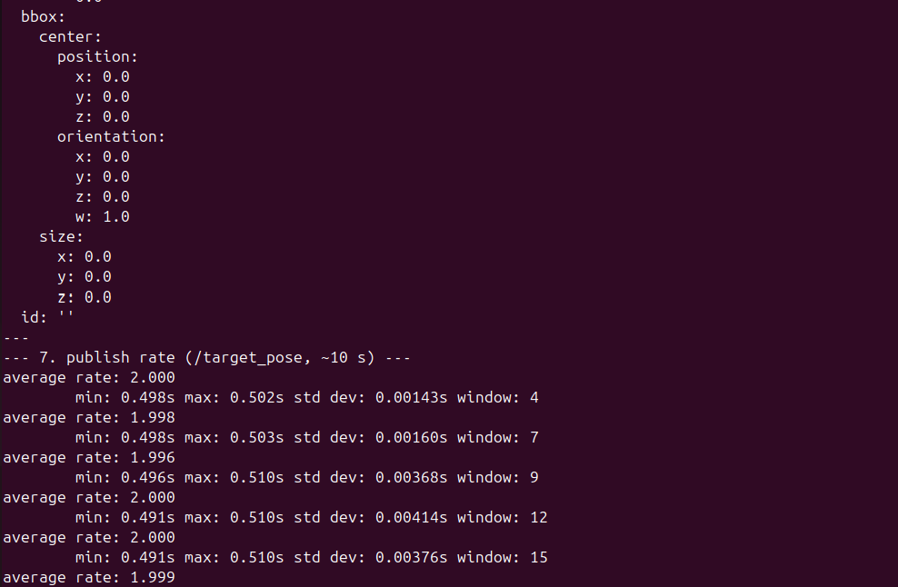
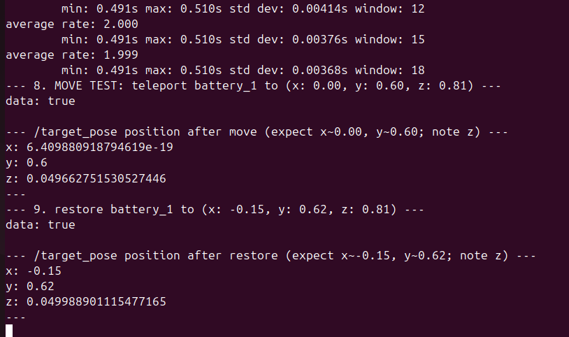

# Verification run

**Node:** `perception/oracle_detector.py` · **Script:** `perception/oracle_verify.sh`
**Run:** 13 September 2026, 16:20 AEST — Ubuntu 24.04, ROS 2 Jazzy, Gazebo Harmonic 8.11.0
**World:** `ewaste_room.sdf`, headless server (`gz sim -s -r`), no arm spawned
**Full captured output:** [`results/oracle_verify_output_2026-09-13.txt`](../results/oracle_verify_output_2026-09-13.txt)

## What is tested

The detector reads the true pose of a target model from `/world/ewaste_room/pose/info` and republishes
it on the three topics downstream consumers subscribe to:

| Topic | Type | Consumer |
|---|---|---|
| `/target_pose` | `geometry_msgs/PoseStamped` | motion-planning node (MoveIt Task Constructor pick task) |
| `/detected_battery_position` | `geometry_msgs/Point` | workspace reachability checker |
| `/detected_objects` | `vision_msgs/Detection3DArray` | the perception contract the vision model will fill |

Nine checks, in order: (1) the pose stream is present, (2) the node starts and acquires ground truth,
(3) all three topics are advertised, (4–6) one full payload from each, (7) publish-rate stability over
~10 s, (8) teleport the target with the `set_pose` service and confirm the published detection follows,
(9) restore it and confirm again.

Steps 8 and 9 are the ones that matter. Everything before them proves the node is publishing; only a
teleport proves it is publishing *the position of the object* rather than a constant that happens to
look right.

## Results

| Check | Result |
|---|---|
| Ground-truth source | `gz.transport13` Python bindings — event-driven, no bridge process |
| Entities visible in `pose/info` | `battery_1`, `battery_2`, `battery_3`, `drop_box`, `desk`, `table`, `side_camera`, … — 29 named entities |
| Ground truth acquired | `battery_1` at (−0.1500, 0.6200, 0.0500) |
| `/target_pose` payload | `frame_id: world`, position (−0.15, 0.62, 0.050), identity orientation |
| `/detected_battery_position` payload | (−0.15, 0.62, 0.050) |
| `/detected_objects` payload | `class_id: battery`, `score: 1.0`, same pose, `frame_id: world` |
| Publish rate | **2.000 Hz** average · min 0.491 s / max 0.510 s · std dev ≤ 0.0041 s (window 18) |
| Teleport to (0.00, 0.60, 0.81) | `/target_pose` → x = 6.4 × 10⁻¹⁹, **y = 0.600**, z = 0.0497 |
| Restore to (−0.15, 0.62, 0.81) | `/target_pose` → **x = −0.150, y = 0.620**, z = 0.0500 |

All nine checks passed. The published detection tracks the object's true position in x and y to
floating-point precision — a teleport to exactly zero comes back as 6.4 × 10⁻¹⁹, which is what an exact
zero looks like after a round trip through the physics engine.

The z column is the odd one out, and is the subject of [06-findings.md](06-findings.md).

## Evidence

**The simulation server starting on the shared world file.** Headless (`-s`), running rather than paused
(`-r`); the node only receives poses while the simulation is actually stepping.

**The node acquiring ground truth, and the first `/target_pose` payload.** The entity list is the 29
names the world publishes — the names that `ros_gz_bridge` had been discarding. All three topics are
advertised.

**The other two contracts.** The same pose arriving as a bare `Point` for the reachability checker, and
as a `Detection3DArray` with `class_id: battery` and `score: 1.0`.

**Rate stability.** Six consecutive windows, converging on 2.000 Hz with a standard deviation that never
exceeds 4.2 ms.

**The teleport test.** `set_pose` moves the battery, the published detection follows it, the battery is
put back, and the detection follows it back. This is the step that distinguishes a detector from a
constant.

